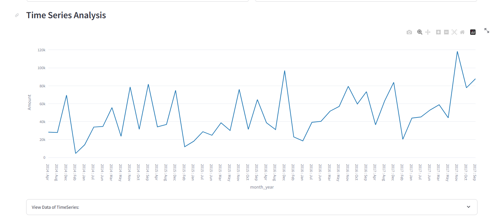
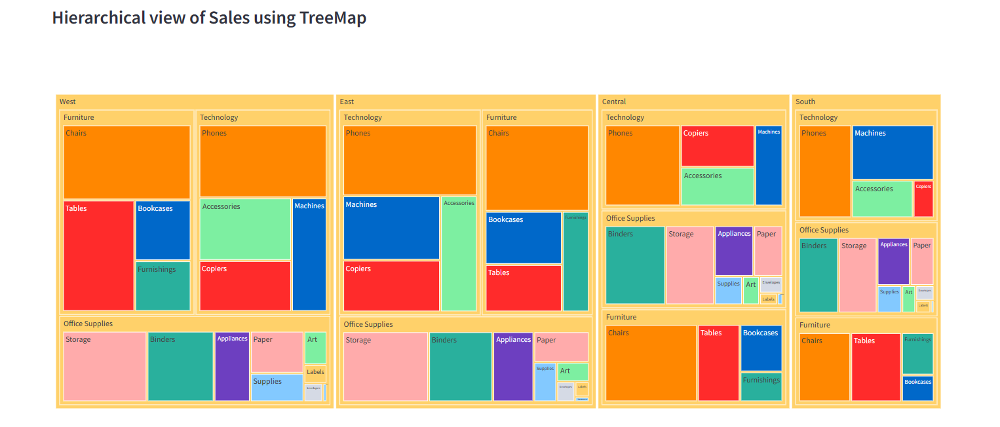
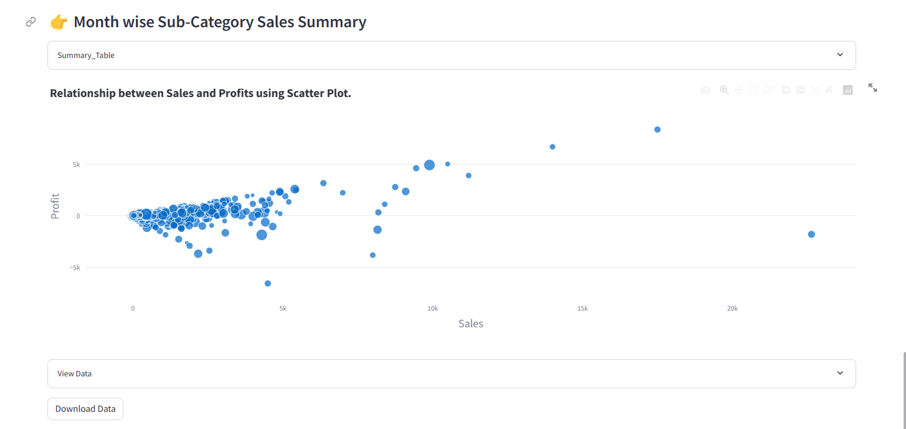

# Dashboard EDA SuperStore

Aplikasi web Streamlit ini menyediakan dashboard interaktif untuk analisis data eksploratori (EDA) dari dataset SuperStore. Dataset ini berisi informasi tentang transaksi penjualan termasuk detail pesanan, informasi pelanggan, kategori produk, dan lainnya.

## Hasil Dashboard

Berikut adalah tangkapan layar dari beberapa visualisasi yang dihasilkan oleh dashboard:

### Ringkasan Penjualan Berdasarkan Kategori


### Tren Time Series dari Penjualan



### Distribusi Penjualan Berdasarkan Wilayah



### Hubungan antara Penjualan dan Keuntungan menggunakan Scatter Plot



## Overview

Dashboard ini memungkinkan pengguna untuk:

- Mengunggah file dataset SuperStore (format CSV, TXT, XLSX, atau XLS).
- Memfilter data berdasarkan rentang tanggal, wilayah, negara bagian, dan kota.
- Melihat ringkasan penjualan berdasarkan kategori dan wilayah.
- Menganalisis tren time series dari penjualan.
- Mengeksplorasi tampilan hirarkis penjualan menggunakan treemaps.
- Memvisualisasikan distribusi penjualan berdasarkan segmen dan kategori.
- Memeriksa hubungan antara penjualan, keuntungan, dan jumlah menggunakan scatter plot.
- Mengunduh data yang difilter dan tabel ringkasan.

## Instalasi dan Penggunaan

Untuk menjalankan dashboard secara lokal, ikuti langkah-langkah berikut:

1. Kloning repositori ini ke mesin lokal Anda:

```bash
git https://github.com/hendrowunga/hendrowunga-Streamlit-Superstore.git
```

2. Navigasi ke direktori proyek:

```bash
cd hendrowunga-Streamlit-Superstore
```

3. Instal paket Python yang diperlukan:

```bash
pip install -r requirements.txt
```

4. Jalankan aplikasi Streamlit:

```bash
streamlit run dashboard.py
```

5. Akses dashboard melalui browser web Anda di `http://localhost:8501`.

## Dependensi

Library Python berikut digunakan dalam proyek ini:

- Streamlit
- Plotly Express
- Pandas
- Numpy

## Dataset

Dataset SuperStore yang digunakan dalam proyek ini berisi informasi tentang transaksi penjualan. Ini mencakup kolom-kolom seperti ID Baris, ID Pesanan, Tanggal Pesanan, Tanggal Pengiriman, Mode Pengiriman, ID Pelanggan, Nama Pelanggan, Segmen, Negara, Kota, Negara Bagian, Kode Pos, Wilayah, ID Produk, Kategori, Sub-Kategori, Nama Produk, Penjualan, Kuantitas, Diskon, dan Keuntungan.
